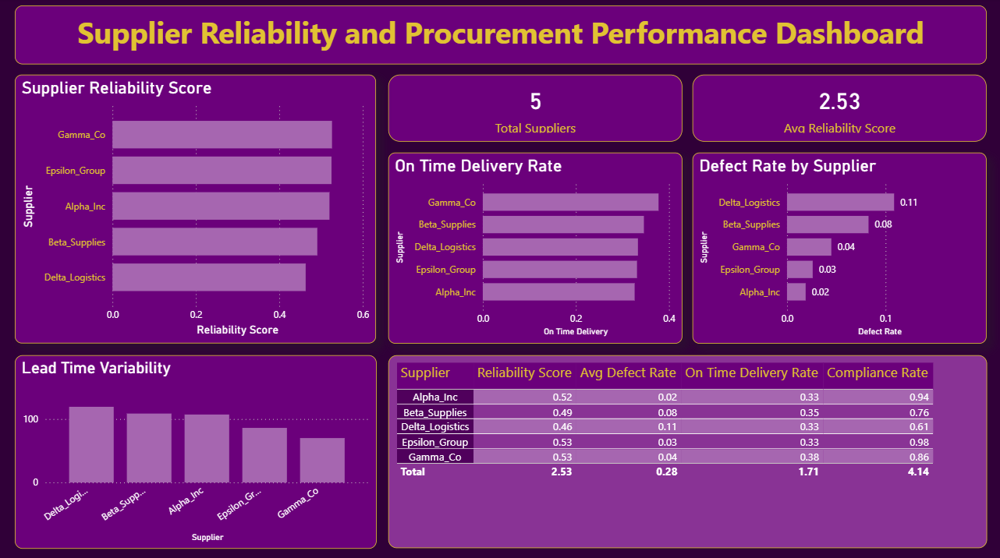

# supplier-reliability-analysis
Supplier Reliability &amp; Procurement Performance Analysis using Python and Power BI
# Supplier Reliability & Procurement Performance Analysis

This project analyzes supplier performance using procurement data and builds a supplier reliability scoring model.

## Objective

Manual supplier evaluations often lead to inconsistent decisions.  
This project applies data analytics to evaluate suppliers using operational metrics.

## Tools Used

- Python (Pandas)
- Power BI
- Data Analytics

## Key Metrics

- Lead Time
- Defect Rate
- Compliance Rate
- On-Time Delivery Rate
- Cost Savings

## Reliability Scoring Model

Supplier reliability score is calculated using:

- 40% On-Time Delivery Rate
- 30% Quality Score (Defect Rate)
- 20% Delivery Consistency
- 10% Compliance Rate

## Output

The project ranks suppliers based on reliability and visualizes insights using a Power BI dashboard.

## Dashboard Preview

